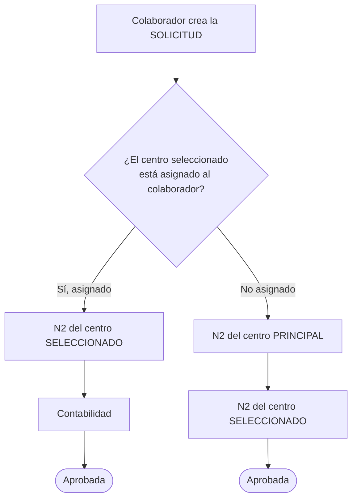
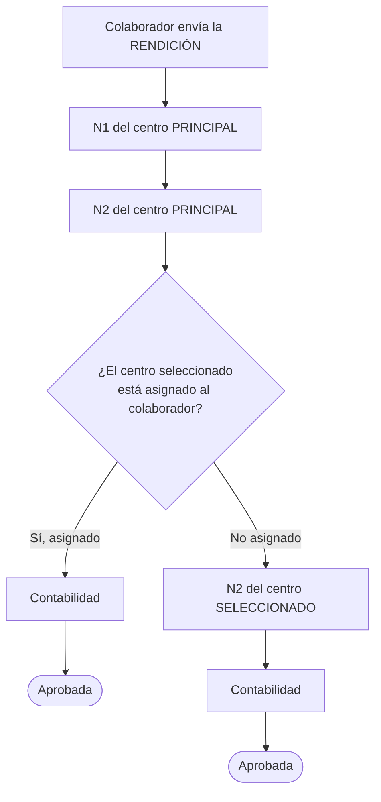
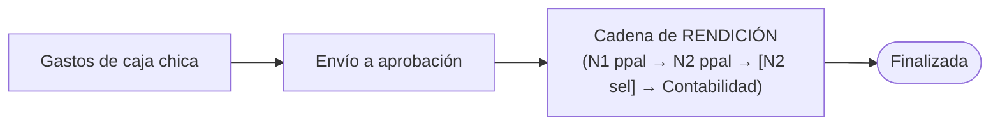
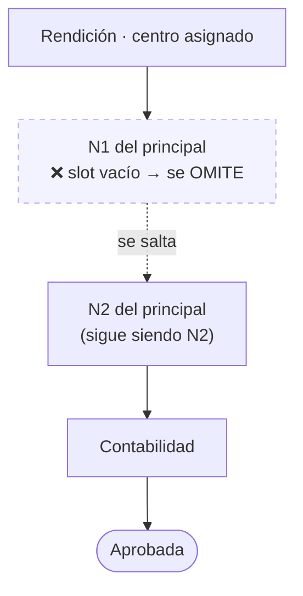
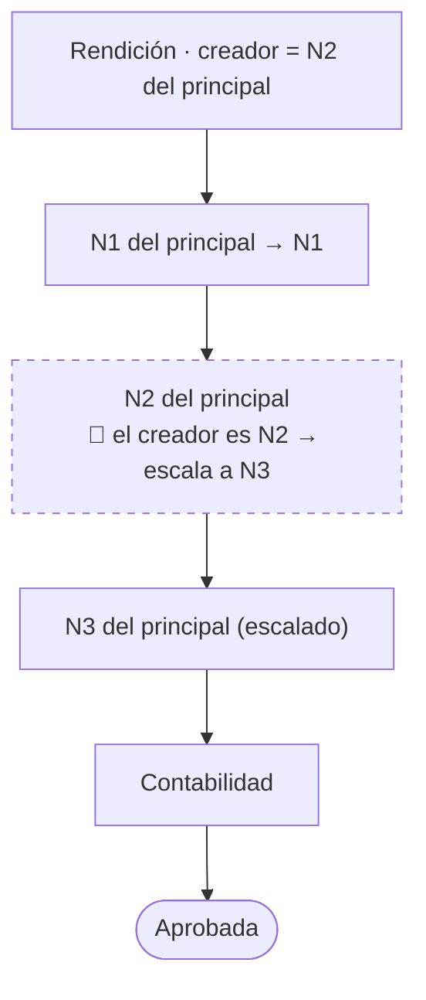
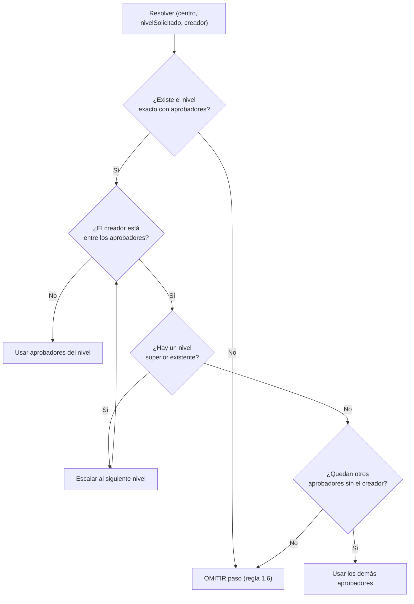

# Diagramas de la Cadena de Aprobación de Viáticos

> **Complementa a:** [ReglasAprobacionViaticos-Analisis.md](./ReglasAprobacionViaticos-Analisis.md)

Este documento representa gráficamente cómo se arma la cadena de aprobación en cada
caso, incluyendo el comportamiento de **slots vacíos** (regla 1.6) y el **escalamiento
por auto-aprobación** (regla 1.5).

## Convenciones

- **N1 / N2 / N3** = aprobador del nivel _explícito_ del centro de costo. La numeración
  es **identidad fija**, no posición: un centro puede tener N2 sin tener N1.
- **Principal** = centro de costo primario del colaborador. **Seleccionado** = centro
  elegido para esa solicitud/rendición.
- **Asignado** = el centro seleccionado está entre los centros asignados al colaborador.
- Un paso con **slot vacío** se **omite** (no se renumera); la cadena continúa con el
  siguiente paso definido.

---

## 1. SOLICITUD de viáticos (regla 1.3)

| Caso | Cadena |
|---|---|
| **A** — centro asignado | `N2(seleccionado)` → `Contabilidad` |
| **B** — centro no asignado | `N2(principal)` → `N2(seleccionado)` |

---

## 2. RENDICIÓN, documentos y RENDICIONES DIRECTAS (regla 1.4)

| Caso | Cadena |
|---|---|
| **A** — centro asignado | `N1(principal)` → `N2(principal)` → `Contabilidad` |
| **B** — centro no asignado | `N1(principal)` → `N2(principal)` → `N2(seleccionado)` → `Contabilidad` |

---

## 3. CAJA CHICA (regla 1.7)

La caja chica pasa por la **misma cadena que la rendición** (sección 2). Es un cambio
respecto al comportamiento histórico, donde la caja chica se acumulaba sin aprobación.

---

## 4. Regla 1.6 — Slots explícitos: un nivel vacío se OMITE (no se renumera)

Ejemplo: rendición para un centro **asignado**, cuyo centro principal **no tiene N1**
(solo tiene N2). El paso N1 se omite; **N2 sigue siendo N2** (no "se convierte en N1").

Resultado: `N2(principal)` → `Contabilidad`.

> ⚠️ La resolución busca el **nivel exacto** solicitado por la regla. Si ese slot no
> existe, el paso desaparece; los demás niveles **conservan su identidad**.

---

## 5. Regla 1.5 — Escalamiento por auto-aprobación

Si el colaborador que crea la solicitud/rendición **es uno de los aprobadores** de un
paso, ese paso **escala al siguiente nivel existente** (N1→N2, N2→N3, …). Si tras
escalar el destino coincide con otro paso del mismo centro/nivel/aprobador, ambos se
**colapsan** en uno solo (para no aprobar dos veces).

Ejemplo: rendición asignada donde el creador **es el N2** del centro principal.

Resultado: `N1(principal)` → `N2→N3(principal, escalado)` → `Contabilidad`.

Casos de borde del escalamiento:
- Si **no hay** un nivel superior definido, se usan los **demás aprobadores** del mismo
  nivel (excluyendo al creador).
- Si el creador era el **único** aprobador y no hay nivel superior, el paso se **omite**.

---

## 6. Algoritmo de resolución de un paso (resumen)

Este algoritmo (resolución de nivel por identidad + omisión de slots vacíos +
escalamiento por auto-aprobación) es la especificación que debe implementar el **motor
de enrutamiento** (backend), y opcionalmente reflejarse en el frontend para previsualizar
la cadena. Ver el plan de implementación en
[ReglasAprobacionViaticos-Analisis.md](./ReglasAprobacionViaticos-Analisis.md) (sección 5).
